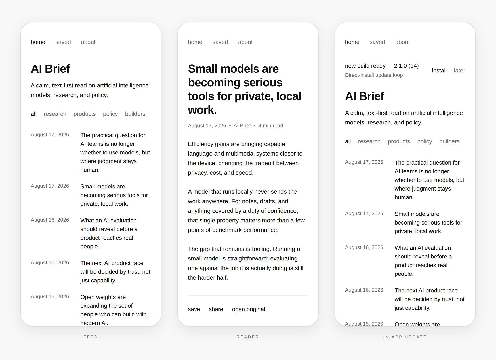
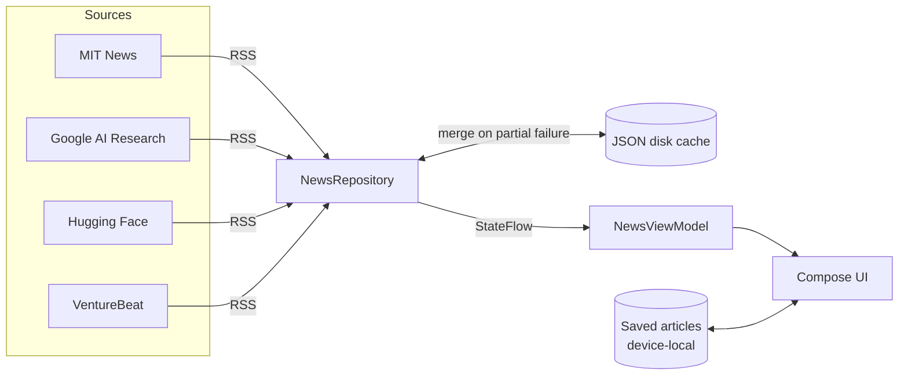
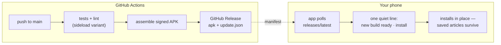

<div align="center">

<picture>
  <source media="(prefers-color-scheme: dark)" srcset="docs/brand/hero-dark.svg">
  
</picture>

<br>

[](https://github.com/Caceras/ai-news-kotlin/actions/workflows/android.yml)


[](https://github.com/Caceras/ai-news-kotlin/releases/latest)

**A native Android reader for artificial intelligence news — no cards, no chrome, no account.**

</div>

---

<picture>
  <source media="(prefers-color-scheme: dark)" srcset="docs/brand/screens-dark.png">
  
</picture>

---

## Design philosophy

Anything added to the app is expected to disappear into this language rather than
announce itself. The update banner is the case in point: one line of text, not a dialog.

| Principle | What it means in the app |
|---|---|
| **Typography-first** | Whitespace and type hierarchy carry the structure. No cards, no elevation, no chrome. |
| **Editorial pairing** | A story is a date and a headline, scannable in a column without visual noise. |
| **True ink dark mode** | `#0E0E0D` against `#EDEDE8`, tuned for long reading at a `1.6x` line height. |
| **Zero layout shift** | Images load into aspect-ratio-reserved containers, so text never bounces. |
| **Invisible polish** | Haptic ticks, crossfade transitions, and a warm start from local cache. |

The palette above is the real one — [`ui/theme/Theme.kt`](app/src/main/java/com/caceras/aibrief/ui/theme/Theme.kt)
is the single source for it, and the artwork in this README is generated from those
same values so the brand and the build cannot drift apart.

---

## How it works



- **100% Kotlin, Jetpack Compose, Material 3** — unidirectional data flow over `StateFlow`, edge-to-edge, Android API 26–36.
- **Resilient offline behaviour** — instant warm start from a persistent JSON cache, cache merging that protects healthy articles through partial network failures, and a curated offline edition when there is no connectivity at all.
- **Two-tier image caching** — an in-memory `LruCache` over a persistent disk cache keyed by SHA-256.
- **Privacy by default** — no analytics, no advertising SDKs, no account, and nothing collected. Saved articles never leave the device.

<details>
<summary><b>Source layout</b></summary>

```
app/src/main/java/com/caceras/aibrief/
├── MainActivity.kt          Compose UI: feed, saved, about, article reader
├── NewsViewModel.kt         Feed state
├── data/NewsRepository.kt   RSS fetch, parsing, caching, saved articles
├── ui/                      Theme and shared components
└── update/                  Direct-install self-updater (sideload builds only)
```

</details>

---

## Getting it on a phone

Not a developer? [**docs/PHONE_WORKFLOW.md**](docs/PHONE_WORKFLOW.md) covers installing,
updating, and requesting changes without touching any of the tooling below.

Merging to `main` is the entire publish action:



The installed app polls `releases/latest/download/update.json` and offers whatever it
finds there. Version identity lives in `gradle.properties` (`aibrief.versionName`,
`aibrief.versionCodeBase`) and is read by **both** Gradle and the workflow, so a published
manifest cannot describe a version its APK does not carry. The build number comes from the
workflow run number, which guarantees a strictly increasing `versionCode`.

---

## Build variants

Three variants come out of one source tree. They differ only in signing and in whether the
self-updater is present.

| Variant | Purpose | Signing key | Self-updater | Minified |
|---|---|---|---|---|
| `debug` | Local development | Android debug key | — | — |
| `sideload` | Direct install on a test phone | `signing/sideload.jks` (committed) | ✅ | ✅ |
| `release` | Google Play artifact | Upload key via `keystore.properties` | — | ✅ |

`sideload` is created with `initWith(release)`, so what gets tested on a phone matches what
would ship in optimisation and debuggability.

<details>
<summary><b>Why a signing key is committed</b></summary>

Android only allows an app to update in place when the new APK is signed with the same key
as the installed one. CI runners are ephemeral, so a generated debug key would differ on
every run and every update would fail with `INSTALL_FAILED_UPDATE_INCOMPATIBLE`.

`signing/sideload.jks` therefore exists to give the test channel a stable identity. Its
password is in `app/build.gradle.kts` and it is deliberately public. **It carries no trust:**
it signs nothing that reaches the Play Store, and the Play upload key is a separate private
key that is never committed.

The `REQUEST_INSTALL_PACKAGES` permission the updater needs lives only in
[`app/src/sideload/AndroidManifest.xml`](app/src/sideload/AndroidManifest.xml), so it
structurally cannot reach the Play artifact.

</details>

---

## Development

**Prerequisites** — JDK 17+ and an Android SDK with the API 36 platform and build-tools.

```bash
./gradlew testSideloadUnitTest   # unit tests
./gradlew lintSideload           # Android lint
./gradlew assembleSideload       # direct-install APK
./gradlew bundleRelease          # Play bundle — requires keystore.properties
```

<details>
<summary><b>Regenerating the brand artwork</b></summary>

The hero wordmark and the screen mockups in this README are generated, not drawn by hand,
so they stay in step with the app's real palette, type scale, and layout metrics.
Everything in [`docs/brand/`](docs/brand/) rebuilds from one script, which needs only
Python and Chromium:

```bash
docs/brand/render.sh                    # or: docs/brand/render.sh /path/to/chromium
```

`gen_hero.py` emits both `hero-{light,dark}.svg` from a single template, and
`gen_screens.py` reproduces the app's own measurements — 28dp content padding, a 125dp
date column, 22dp between rows — so a change to the app's layout should be mirrored there.
Each mockup shows exactly one state: a build that is *offered* and a build that is
*downloading* are different states and never appear in the same screen.

</details>

<details>
<summary><b>Google Play release</b></summary>

1. Copy `keystore.properties.example` to `keystore.properties`.
2. Point `storeFile`, `storePassword`, `keyAlias`, and `keyPassword` at your private upload keystore. Neither file is ever committed.
3. Run `./gradlew bundleRelease` to produce `app/build/outputs/bundle/release/app-release.aab`.
4. Work through [PLAY_RELEASE_CHECKLIST.md](PLAY_RELEASE_CHECKLIST.md).
5. Publish [PRIVACY.md](PRIVACY.md) at a stable HTTPS URL and link it in Play Console.

</details>
